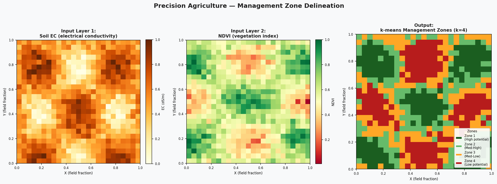
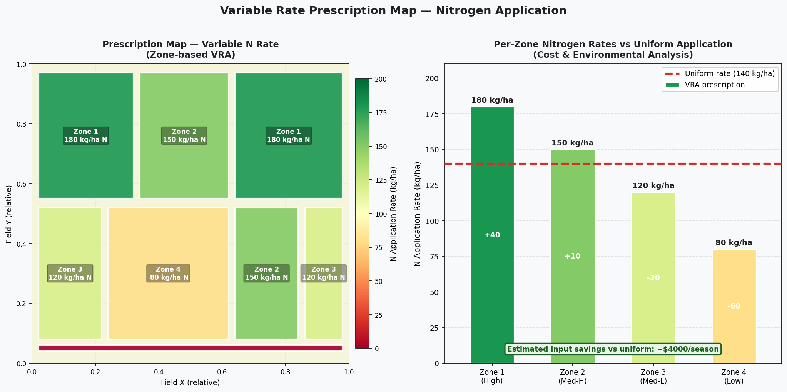
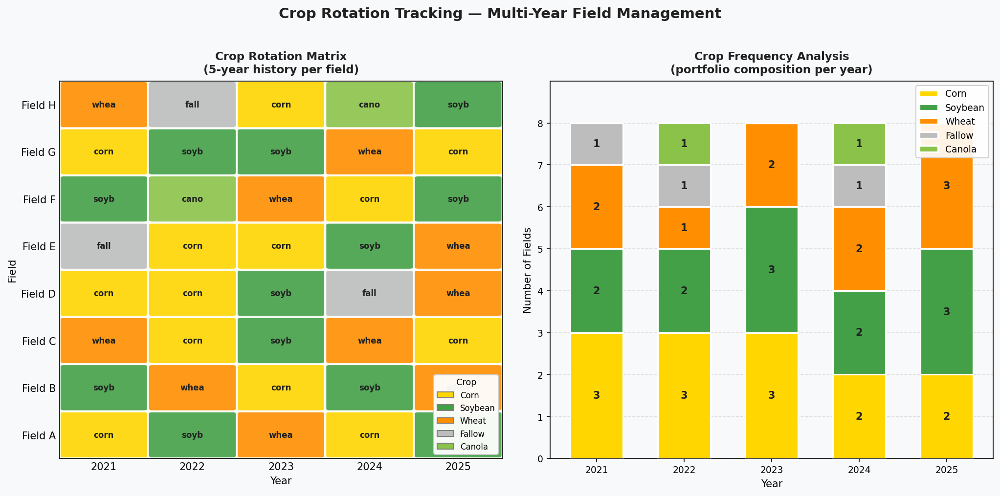

# Agricultural Zone Mapping
**Author:** Emmanuel Oyekanlu — Principal AI/Data Solutions Engineer  
**Focus:** Precision agriculture zone mapping, management zone delineation, and variable rate prescription generation

---

## Visual Gallery

The images below are generated directly from this repository's code using only `matplotlib` and `numpy`.

### Management Zone Delineation (k-means)
Three-panel workflow: soil EC input layer → NDVI input layer → k-means clustered management zones (k=4), from low-potential (Zone 4) to high-potential (Zone 1).



### Variable Rate Prescription Map
Left: nitrogen application prescription map by zone (choropleth, 80–180 kg/ha). Right: per-zone rates vs uniform application with estimated input savings.



### Crop Rotation Tracking — 5-Year History
Left: rotation matrix grid (8 fields × 5 years) coloured by crop type. Right: stacked bar showing portfolio composition per year — corn, wheat, soybean, canola, fallow.



---

## Overview

This repository demonstrates the complete precision agriculture workflow from field delineation to variable rate prescription map generation. Each script represents a real stage in a precision agriculture data pipeline: from raw field boundary definition through soil analysis, management zone clustering, yield processing, prescription generation, and multi-year crop rotation tracking.

These techniques underpin modern data-driven farming systems and connect directly to large-scale agricultural data engineering platforms that process satellite imagery, IoT sensor streams, and equipment telemetry at scale.

---

## Precision Agriculture Concepts

### Management Zones
Management zones are subdivisions of an agricultural field that share similar soil, yield, or environmental characteristics. Instead of applying uniform rates of fertilizer, water, or chemicals across an entire field, precision agriculture uses management zones to apply different rates where different rates are needed — saving input costs while improving yield and reducing environmental impact.

**Zone delineation methods:**
- **Soil sampling grid:** Sample soil properties on a 1-acre grid, interpolate, classify
- **Yield stability analysis:** Cluster zones based on 5+ years of yield monitor data
- **Remote sensing:** Use NDVI, NDRE, or soil electrical conductivity (EC) maps
- **k-means clustering:** Combine multiple layers (EC, NDVI, elevation, slope) into zones

### Variable Rate Application (VRA)
VRA technology adjusts application rates as equipment moves through the field:
- **Prescription map:** GeoJSON/Shapefile defining rate zones → loaded into controller
- **Section control:** Boom sections turn on/off to avoid over-application
- **Implement-specific prescriptions:** Planter, sprayer, and spreader each have separate prescriptions

### Crop Rotation
Planned alternation of crop species across growing seasons on the same land:
- Breaks pest and disease cycles
- Balances soil nutrient depletion/replenishment (legumes fix nitrogen)
- Regulated by some conservation programs (FSA, EQIP)
- Data engineering challenge: track rotation sequences across years and fields

---

## Connection to Data Engineering Pipelines

### Inbound Data
- Field boundaries: USDA FSA CLU (Common Land Unit) API, farm management platforms
- Soil data: SSURGO (USDA Web Soil Survey API), on-farm soil sampling
- Yield data: ISO XML from combine yield monitors, farm management software exports
- Weather: NOAA, DTN, Arable sensor networks

### Processing Layer (where this repo lives)
- Zone delineation algorithms (k-means, FCM)
- Prescription map generation
- Rotation sequence tracking
- Yield anomaly detection

### Outbound Data
- Prescription maps: ISO XML, ISOXML Task Data for variable rate controllers
- Analytics: per-zone yield trends to farm management dashboards
- Compliance: USDA program documentation, carbon credit verification

### Pipeline Integration
```
SSURGO API → Soil GeoDataFrame → k-means clustering → Zone GeoDataFrame
                                                              ↓
Yield Monitor Points → Spatial Interpolation → Zone Averages → Prescription Map
                                                              ↓
                                              → ISO XML → Variable Rate Controller
```

---

## Repository Structure

```
06_agricultural_zone_mapping/
├── README.md
├── requirements.txt
├── .gitignore
├── 01_field_delineation.py         # Field boundary → management zone grid
├── 02_soil_zone_analysis.py        # Soil type spatial analysis per field
├── 03_management_zones.py          # k-means clustering → zone polygons
├── 04_yield_map_processing.py      # Yield monitor points → choropleth map
├── 05_variable_rate_prescription.py # Zone-based fertilizer prescription
├── 06_crop_rotation_tracking.py    # Multi-year rotation sequence analysis
└── data/
    ├── farm_boundary.geojson       # ~500 ha Kansas farm polygon
    └── soil_types.geojson          # 8 soil type polygons within boundary
```

---

## Script Descriptions

### `01_field_delineation.py`
Creates a field boundary polygon and programmatically subdivides it into a regular grid of management zone sub-polygons using Shapely geometry operations. Assigns zone IDs and exports to GeoJSON. Demonstrates the foundational zone generation step.

### `02_soil_zone_analysis.py`
Performs spatial overlay between soil type polygons (SSURGO-style) and field boundaries. Computes area of each soil type within each field, identifies dominant soil type, and generates a visual soil map legend. Connects to USDA SSURGO concepts.

### `03_management_zones.py`
Implements k-means clustering on simulated multi-layer soil data (pH, organic matter, EC) to delineate management zones. Converts the cluster raster back to polygon zones using contour extraction. This is the standard precision agriculture workflow.

### `04_yield_map_processing.py`
Simulates a yield monitor point cloud (1,000 GPS-tagged harvest points) and processes it into a spatial analysis product: spatial interpolation summary per zone, choropleth visualization, and outlier flagging. Mirrors real combine yield data pipelines.

### `05_variable_rate_prescription.py`
Takes management zones and soil analysis results to generate a fertilizer prescription map. Assigns nitrogen rates per zone based on yield goal and soil nutrient levels. Exports prescription as both GeoJSON and CSV table (for loading into rate controllers).

### `06_crop_rotation_tracking.py`
Manages multi-year crop history for the same set of fields. Detects rotation sequence per field, flags violations of best-practice rotation guidelines, and generates a crop history timeline visualization.

---

## Setup & Usage

```bash
python -m venv venv
source venv/bin/activate
pip install -r requirements.txt

python 01_field_delineation.py
python 02_soil_zone_analysis.py
python 03_management_zones.py
python 04_yield_map_processing.py
python 05_variable_rate_prescription.py
python 06_crop_rotation_tracking.py
```

---

## Key Technologies

| Library | Role |
|---|---|
| GeoPandas | Vector data I/O and spatial operations |
| Shapely | Geometry construction, grid generation, clipping |
| scikit-learn | K-means clustering for zone delineation |
| NumPy | Raster grid simulation, interpolation |
| Matplotlib | Visualization and map generation |
| Pandas | Tabular data management, rotation tracking |

---

*Part of the Geospatial Data Engineering portfolio by Emmanuel Oyekanlu.*
